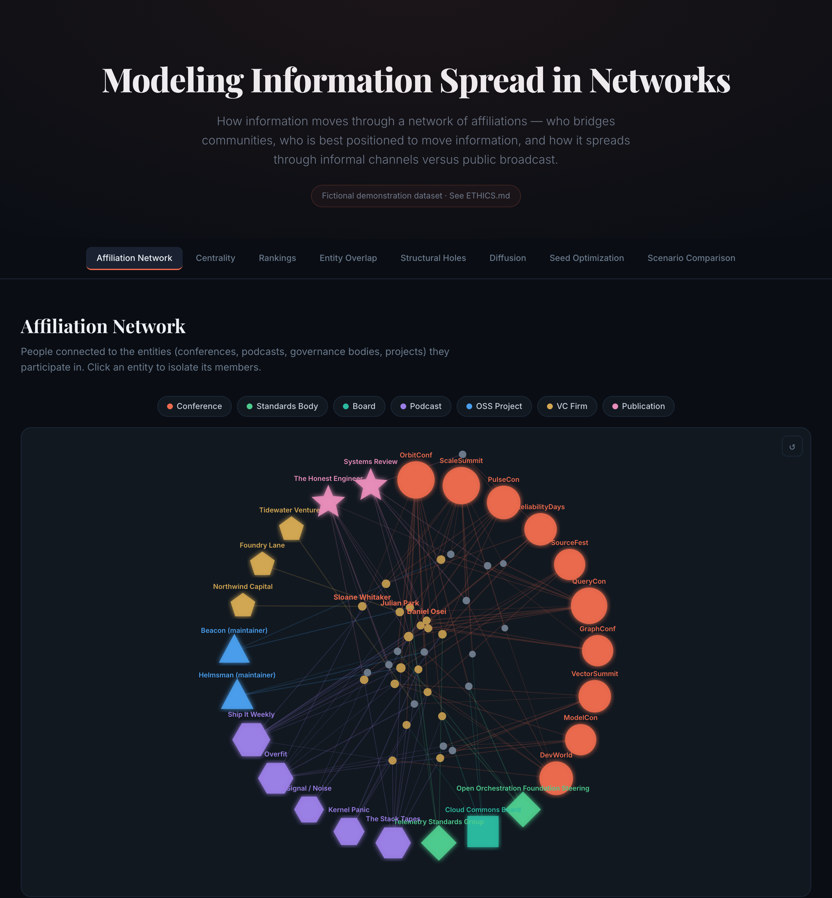

# Modeling Information Spread in Networks

A domain-agnostic toolkit for analyzing how information moves through a network of **affiliations** — who bridges communities, who is best positioned to move information, and how it spreads through informal channels versus public broadcast.

**▶ [Explore the live interactive dashboard →](https://swedewhite.github.io/information-spread-networks/)**

[](https://swedewhite.github.io/information-spread-networks/)

From membership metadata alone (no message content), it computes who bridges otherwise-disconnected communities, simulates how information would spread under different framings, and finds the smallest set of people who would seed the widest reach.

The method is **domain-agnostic**. Any network of people-and-affiliations works: academic co-authorship and committees, political coalitions, club and board memberships, professional communities. The dataset shipped here is a tech-style ecosystem (conferences, podcasts, open-source projects, investors), but that's just one illustrative example — swap in your own.

> ### ⚠️ This is a demonstration built on entirely fictional data
> Every person, company, conference, podcast, and project in this repository is **invented**. The dataset is hand-authored to exhibit interesting network structure (clusters joined by a few brokers), not to represent any real individuals or organizations. Any resemblance to real people or entities is coincidental. See [`ETHICS.md`](ETHICS.md) for why this demo uses synthetic data instead of real public figures — it's the most important file here.

This project applies the analytical framework from [`paulrevere`](https://github.com/swedewhite/paulrevere) (a Python port of Kieran Healy's "Using Metadata to Find Paul Revere"), with three additional analytical layers:

1. **Composite broker score** — a weighted blend of betweenness, closeness, and eigenvector centrality emphasizing brokerage
2. **Epidemiological diffusion model** — SIR contagion simulation showing how information spreads under "insider gossip" vs. "public announcement" framings
3. **Seed optimization** — CELF greedy influence-maximization to find the optimal set of N people to seed information with

## Architecture

```
information-spread-networks/
├── data/
│   ├── people.yaml          # 34 invented figures across 7 clusters
│   ├── entities.yaml        # 25 invented conferences, podcasts, boards, projects
│   ├── memberships.yaml     # 131 weighted person-entity associations
│   └── scenarios/
│       ├── insider_gossip.yaml       # SIR params: low β, low γ, high α
│       └── public_announcement.yaml  # SIR params: higher β, high γ, low α
├── src/
│   ├── graph.py             # Bipartite construction + weighted projection
│   ├── centrality.py        # 3 centrality measures + composite + structural holes
│   ├── diffusion.py         # Monte Carlo SIR information-diffusion simulator
│   ├── optimize.py          # CELF greedy influence-maximization
│   └── dashboard.py         # HTML/D3.js dashboard generator (8 sections)
├── main.py                  # Orchestrator
├── docs/index.html          # Generated dashboard — also the GitHub Pages site
└── assets/                  # README preview image
```

## Running

```bash
# Install deps
pip install -r requirements.txt

# Generate the dashboard
python3 main.py

# Quick mode (smaller Monte Carlo run counts — for development)
python3 main.py --quick

# Generate and open in browser
python3 main.py --open
```

## Dashboard Sections

The generated `docs/index.html` is a single self-contained HTML file with eight interactive D3.js sections (this is exactly what the [live demo](https://swedewhite.github.io/information-spread-networks/) serves):

| # | Section | What it shows |
|---|---------|---------------|
| 1 | **Affiliation Network** | Bipartite graph: people ↔ entities. Entities are color-coded by type and shape-coded (circle, diamond, hexagon, triangle, etc.). Click an entity to isolate its members. |
| 2 | **Centrality Analysis** | Person-person co-affiliation network with temperature-mapped centrality coloring. Toggle between composite, betweenness, closeness, and eigenvector. |
| 3 | **Centrality Rankings** | Top-10 tables with inline bar charts for each measure. |
| 4 | **Entity Overlap** | Heatmap showing how many people belong to each pair of entities. |
| 5 | **Structural Holes** | Side-by-side: full network vs. network with top brokers removed; quantified delta metrics. |
| 6 | **Diffusion Simulation** | Animated playback of an SIR information-spread simulation. Toggle gossip vs. announcement scenarios; scrub through time. |
| 7 | **Seed Optimization** | The optimal seed set highlighted on the network, with a marginal-reach-gain bar chart. |
| 8 | **Scenario Comparison** | Cumulative reach (solid) and active sharers (dashed) for both scenarios on a single chart. |

## Data Schema

Memberships are stored as YAML triples with weights:

```yaml
- person: ada-okafor
  entity: orbitconf
  role: keynote
  weight: 3
```

Weights: `1` = attendee/mentioned, `2` = recurring participant/member, `3` = keynote/governance/maintainer.

The person-person projection produces edge weights via weighted matrix multiplication:

> edge_weight(p_a, p_b) = Σ over shared entities e of [weight(p_a, e) × weight(p_b, e)]

Edge weights are then normalized to [0, 1] (relative to the strongest tie) so diffusion parameters stay interpretable.

### Using your own data

The code is data-agnostic: it reads whatever is in `data/*.yaml`. To explore a different network, replace the three data files (keeping the schema) and re-run `python3 main.py`. Referential integrity is enforced — every `person`/`entity` in `memberships.yaml` must exist in `people.yaml`/`entities.yaml`. **If you point this at real people, read [`ETHICS.md`](ETHICS.md) first.**

## Diffusion Model

Standard SIR with edge-weight-aware transmission:

```
P(transmit across edge) = 1 − (1 − β)^(α · w)
```

where `w` is the normalized edge weight, `β` is base transmission rate, and `α` controls how steeply tie strength matters. `γ` is the per-step probability that an Informed node transitions to Retained (stops sharing).

| Scenario | β | γ | α | Behavior |
|----------|---|---|---|----------|
| Insider Gossip | 0.035 | 0.08 | 3.0 | Slow start, but persists. Strong ties dominate. |
| Public Announcement | 0.07 | 0.30 | 1.0 | Fast spike, fast burnout. Tie strength matters less. |

Each scenario is run as a Monte Carlo simulation (200 runs by default) and the dashboard shows mean trajectories with std-dev confidence bands.

## Seed Optimization

Implements greedy + CELF (Cost-Effective Lazy Forward, Leskovec 2007) influence maximization. Approximation ratio (1 − 1/e) ≈ 63% by submodularity.

For each candidate node, we Monte-Carlo-estimate the marginal gain in reach when added to the current seed set. The CELF priority queue avoids re-evaluating candidates whose previous gain was already lower than another candidate's new gain.

**The optimal seed set is not the list of top brokers.** Structural centrality (who bridges communities) and diffusion reach (who spreads to the most people) are different quantities — in experiments on this dataset, the highest-betweenness nodes are never the reach-optimal seeds. See [`experiments/`](experiments/README.md) for that and a deeper investigation into why the model is kept deliberately simple.

## Origin Story

This project was forked in spirit from [`paulrevere`](https://github.com/swedewhite/paulrevere), which ports a 2017 Wolfram Language analysis of colonial Boston revolutionary networks (Kieran Healy's "Using Metadata to Find Paul Revere") to Python + D3.js. The original demonstrated how membership-list metadata, with no message content at all, was sufficient to identify the most dangerous revolutionaries in 1770s Boston. This project generalizes that analytical framework to arbitrary affiliation networks, with the addition of dynamic information-diffusion modeling.

The core insight remains: **structural position in a network of memberships is a powerful (and often overlooked) predictor of influence.** A version of this analysis run on *real* public figures lives privately; this public repository deliberately ships with fictional data — see [`ETHICS.md`](ETHICS.md).

## License

Released under the [MIT License](LICENSE) — free to use, modify, and redistribute. The dataset is fictional and carries no additional restrictions.
